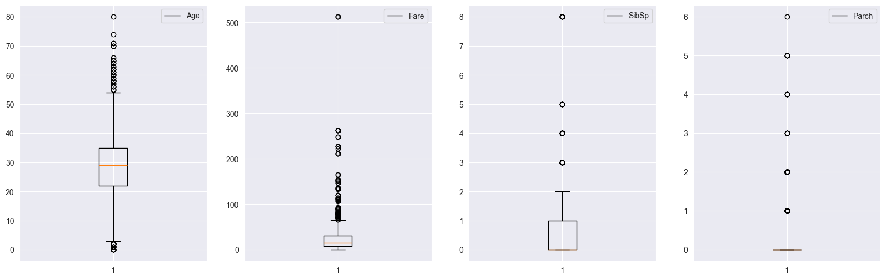
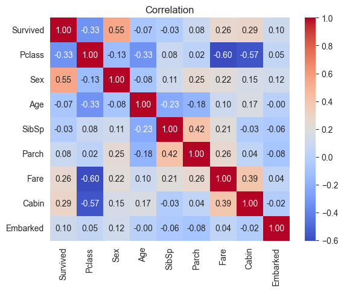
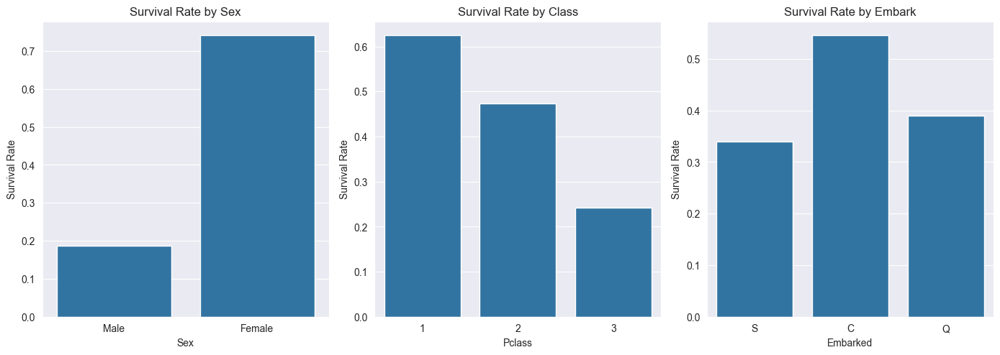
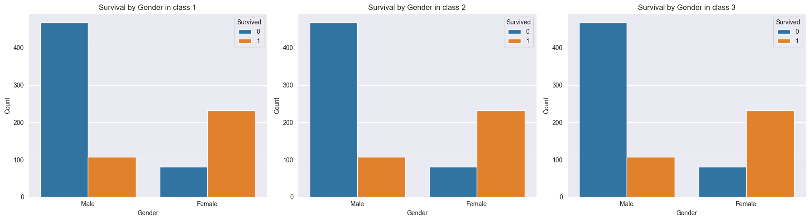
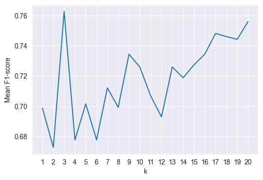
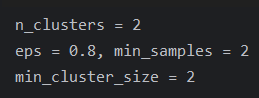
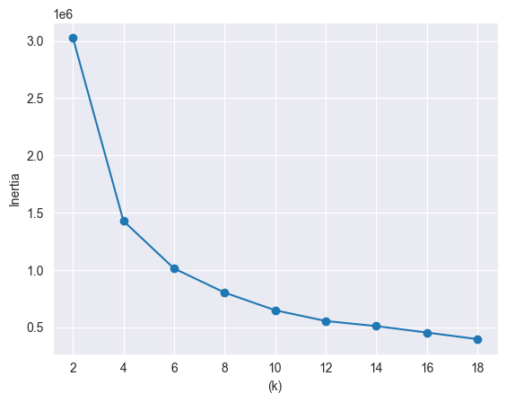
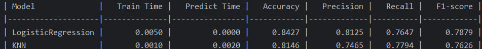
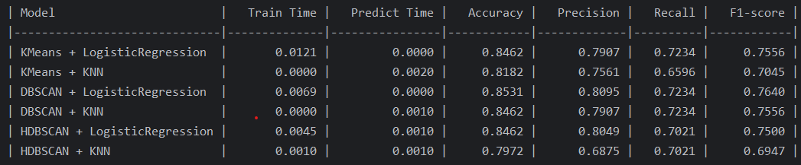

## تاثیر خوشه بندی بر مدل های طبقه بندی

### معرفی پروژه
در این پروژه با استفاده از داده های تایتانیک به بررسی تاثیر خوشه بندی بر مدل های طبقه بندی پرداخته ایم. لازم به ذکر است که صرفا به بررسی مدل های KNN, LogisticRegression پروژه شامل دو بخش است:1- اندازه گیری زمان اجرا و دقت مدل های طبقه بندی  بدون خوشه بندی 2- خوشه بندی داده ها و اجرا مدل های طبقه بندی بر روی آن ها.

##  پیش ‌نیاز ها

برای اجرای این پروژه نیاز به نصب پکیج‌ های زیر دارید که در فایل `requirements.txt` نیز آمده است:

```
pandas~=2.3.1
numpy~=2.3.2
matplotlib~=3.10.5
seaborn~=0.13.2
plotly~=6.2.0
scikit-learn~=1.7.1
tabulate~=0.9.0
```

نصب با دستور:
```bash
pip install -r requirements.txt
```


### مراحل انجام پروژه:

### 1. خواندن داده‌ ها
داده‌ های مسافران تایتانیک را  از فایل `titanic.csv`  kaggle بارگذاری شده‌ اند. این داده‌ ها از سایت [Kaggle](https://www.kaggle.com/datasets/yasserh/titanic-dataset) 

### 2. بهینه ‌سازی داده ‌ها
با بررسی داده ها می توان مشاهده کرد که مقادیری در ستون وجود دارد که خالی است و باید آن ها را با مقادیر مناسب جایگزین کنیم تا تحلیل مان دقیق تر باشد.هم چنین داده هایی در تایپ رشته وجود دارد، که با انکود کردن آن ها به اعداد می توانیم از حجم داده بکاهیم. همان طور که مشاهده می شود پس از عملیات های بهنیه سازی حجم داده حدود 73 درصد کم شده است. سه ستون  چون تاثیری در تحلیل ندارد آن ها را می توانیم در نظر نگیریمPassengerId, Name,Ticket ستون های Sex,Embarked,Cabin نیز به یک سری اعداد تبدیل شده اند. در نهایت  برای کاهش حجم بیشتر فایل داده از تابع  `auto_data_type`  استفاده شده است که همه داده ها را بررسی کرده و آن ها را به دیتا تایپی که باعث می شود حجم کمتری بگیرد و داده ای از بین نرود، تبدیل کند


### 3. پر کردن مقادیر خالی با مقادیر مناسب

با توجه به این که ستون Cabin تعداد مقادیر null زیادی دارد نمی توان آن ها را با مد ستون کابین پر کنیم، زیرا تحلیل مان اشتباه می شود چون اکثر از کابین c مسافران می شوند و هم چنین ممکن است که واقعا بعضی از افراد کابین نداشته باشند، پس یک دسته بندی جدید به نام unknown با مخفف u درست می کنیم و مقادیر خالی را با آن ها پر می کنیم.

### 4. تشخیص داده ‌های پرت و حذف آن ها 

 از پلات زیر می توان نتیجه گرفت که یک نفر بیشترین Fare داشته. پس آن را حذف می کنیم



### 5. تحلیل اکتشافی 

از نمودار زیر می توان استنباط کرد که، جنسیت، پول بلیط و کلاس بلیط بیشترین تاثیر دارند.


ابتدا به بررسی نرخ نجات مسافرین می پردازیم. آن ها را در سه بخش کلاس بلیط، محلی که سوار شدند و جنسیت بررسی می کنیم. از نمودار های زیر می توان چندین نتیجه گرفت :1- مسافران کلاس 1 و کلاس 3 کمترین بیشتر نجات یافتند. 2- مسافرانی که از بندر C سوار شده‌اند، بالاترین نرخ نجات را داشتند. 3-  زنان نرخ نجات شان بیشتر از مردان بوده است.



سپس  به بررسی نرخ نجات مسافرین در کلاس مسافری می پردازیم . از نمودار های زیر می توان چندین نتیجه گرفت :1- در کلاس 1، زنان  یک مقدار بیشتر نسبت به مردان نجات یافتند.2- در کلاس 2 زنان نسبت به مردان بیشتر نجات یافته بودند. 3- در کلاس ۳ تعداد نجات یافته ها کم بوده اما با این حال زنان بیشتر از مردان نجات یافته اند




### 6. تقسیم داده ‌ها
ابتدا داده ها را استاندارد سازی و به داده های train, test تقسیم می کنیم. مدل knn  با k های مختلف تست می کنیم تا مناسب ترین مقدار برای k  را بتواین م انختل کنیم. یکی از کارهایی که میشه انجام داد تا به نتیجه یکسان برسیم این است که پارامتر های  random_state که نشان دهنده تقسیم داده‌ها در هر اجرا  و پارامتر stratify  که  توزیع یکسان نسبت کلاس ‌های بقا در داده های آموزش و تست را بر عهده دارد را تنظیم کنیم.

### 7. آموزش مدل ‌ها
با استفاده از f1-score در هر مرحله از انتخاب k بررسی می کنیم که مقدار k چقدر باشد تا بیشترین دقت را داشته باشیم. با توجه به نمودار زیر مقدار k را برابر 3 در مدل knn قرار می دهیم.


بر اساس معیار silhouette_score مناسب ترین مقادیر برای پارامتر های مدل های خوشه بندی را بدست می آوریم.

<div align="center">
  
  
</div>

### 8. ارزیابی مدل ‌ها

در مقایسه‌ مدل‌ها با و بدون خوشه ‌بندی، می توان مشاهده کرد که  که افزودن خوشه ‌بندی در  DBSCAN موجب بهبود جزئی در دقت مدل Logistic Regression شده است با این حال، مدل KNN بدون خوشه‌ بندی عملکرد بهتری نسبت به حالت همراه با خوشه‌ بندی HDBSCAN دارد. از نظر زمان، اجرای مدل‌ها با خوشه‌ بندی تفاوت قابل‌  توجهی در زمان پیش ‌بینی ندارند، اما زمان آموزش در برخی ترکیب ‌ها مانند KMeans + LogisticRegressionافزایش یافته است. در مجموع، خوشه ‌بندی می‌ تواند به‌ عنوان یک پیش ‌پردازش مفید باشد.






### 📂 ساختار پروژه

```
titanic-passenger-survival-prediction/
│
├── README.md
├── main.ipynb 
├── requirements.txt 
├── titanic.csv 
│
└── images/ 
├── Best_k_kmeans.png 
├── Best_k_knn.png 
├── Best_parameters.png  
├── Correlation.png 
├── output1.png 
├── output2.png 
├── Survival_numbers.png 
└── Survival_rate.png          
```

